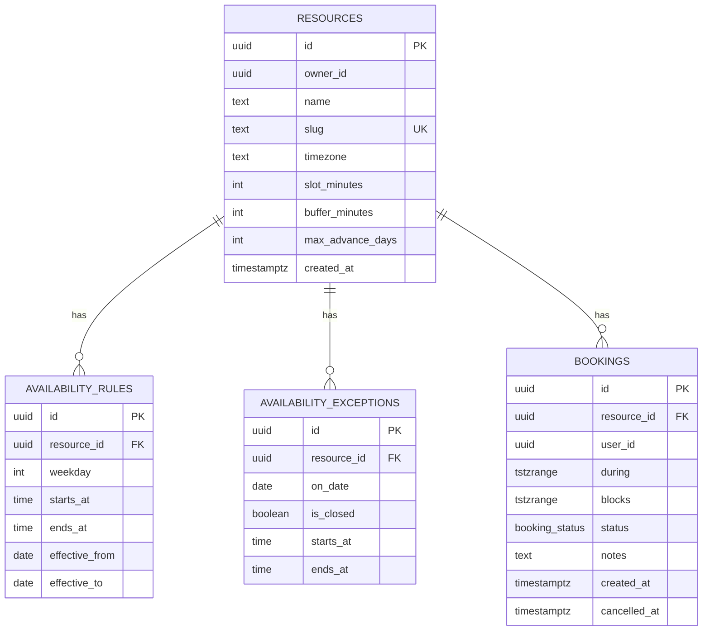

# noclash


A resource booking app — rooms, courts, tutor slots, anything with a weekly
schedule. Owners define availability rules and a timezone; visitors book open
slots. No payments, no teams, no notifications — the point of this project is
one specific correctness guarantee, done properly, not a full SaaS surface.

## The centerpiece

**Two overlapping bookings for the same resource cannot both exist — not
because application code checks for it, but because Postgres refuses to
store them.**

```sql
ALTER TABLE bookings
	ADD CONSTRAINT bookings_no_overlap
	EXCLUDE USING gist (resource_id WITH =, blocks WITH &&)
	WHERE (status = 'confirmed');
```

An `EXCLUDE` constraint is checked the same way `UNIQUE` is — as part of row
insertion, under the same locking Postgres already uses to guarantee
uniqueness. There is no `SELECT` to check for conflicts, then an `INSERT` if
none are found; that pattern is racy no matter how carefully it's written,
because a second transaction can slip into the gap between the two
statements. Here, two concurrent transactions inserting overlapping ranges
genuinely cannot both commit — the database resolves the race, not the
application.

This is exercised by a real concurrency test
([`src/db/bookings-exclusion.test.ts`](src/db/bookings-exclusion.test.ts))
that fires two conflicting inserts from separate connections with
`Promise.allSettled` — no `await` between them — and asserts exactly one
survives. The full reasoning, alternatives considered, and a production
incident this surfaced (a real `40P01` deadlock under CI, not a hypothetical)
are written up in
[ADR-001](docs/adr/0001-exclusion-constraint-in-database.md).

## Stack

- Next.js (App Router) + TypeScript + Server Actions
- Tailwind CSS
- Postgres — hand-written SQL migrations for anything Drizzle can't express
  (exclusion constraints, GiST indexes, triggers); Drizzle ORM for the rest
- Vitest, run against a real local Postgres — no mocked database
- GitHub Actions for CI

## Schema



`availability_rules` stores a weekly schedule as wall-clock `time` plus the
resource's IANA timezone — never a bare `timestamp`. `blocks` is `during`
widened by `buffer_minutes` on each side, computed by a trigger rather than a
generated column, because interval arithmetic on `timestamptz` is `STABLE`
(depends on session timezone across DST boundaries), not `IMMUTABLE`, and
Postgres rejects `STABLE` expressions in generated columns.

Turning that weekly schedule into actual bookable slots is a small pipeline
of pure, unit-tested functions in
[`src/lib/scheduling/`](src/lib/scheduling/), each with explicit test
coverage for DST edge cases (a spring-forward gap where a wall-clock time
never happens, an autumn-back hour that happens twice):

```
expandRules       weekly rule → concrete UTC windows for a date range
applyExceptions    close a day, or override/extend its hours
openSlots          subtract already-booked ranges
sliceIntoSlots     cut what's left into fixed-length bookable picks
```

## Getting started

Requires Docker (for local Postgres) and pnpm.

```bash
pnpm install
cp .env.example .env
pnpm db:up        # starts Postgres in Docker
pnpm db:migrate    # applies drizzle/*.sql
pnpm db:seed       # one resource, a handful of bookings
pnpm dev
```

## Scripts

| Command | Does |
|---|---|
| `pnpm dev` | Dev server |
| `pnpm build` | Production build |
| `pnpm db:up` | Start local Postgres (Docker) |
| `pnpm db:generate` | Generate a Drizzle migration from schema changes |
| `pnpm db:migrate` | Apply migrations in `drizzle/` |
| `pnpm db:seed` | Seed one resource plus sample bookings |
| `pnpm test` | Vitest — unit and integration, needs `pnpm db:up` first |
| `pnpm lint` | ESLint |
| `pnpm typecheck` | `tsc --noEmit` |

## Testing

`pnpm test` runs against a real local Postgres (`TEST_DATABASE_URL`, a
separate database from `DATABASE_URL` so the test harness can freely
truncate tables between tests without any risk of touching real data) — no
mocked database layer. Domain logic in `lib/scheduling/` is pure functions
tested in isolation; database constraints (the exclusion constraint, RLS
once Phase 3 lands) are tested against the constraint itself, not a
reimplementation of it.

## Status

Actively built feature-by-feature; see
[`DEVELOPMENT_PLAN.md`](DEVELOPMENT_PLAN.md) for the phase-by-phase plan and
the reasoning behind it. Roughly:

- **Done** — resources, bookings, the exclusion constraint and its
  concurrency test, weekly availability rules and one-off exceptions,
  timezone-aware slot generation (rules → exceptions → open slots → fixed
  picks), a resource creation form with an IANA timezone picker.
- **Not yet** — auth and Row Level Security (Phase 3), a slot-picker UI wired
  to the generation pipeline above (the booking form still takes a free-text
  date and time), and deployment.

No live demo link yet — this section will get one once Phase 3/4 land.
